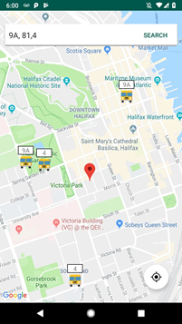

# HRM-Bus-Tracker
Bus Tracker is an android application (Minimum API Level: 23) to track the position Transit in Halifax. The application has a search bar at top and a re-center button placed on the top of Google Map.

 

## Functionalities
### Basic Features
1.	Shows the Position of all/selected Transits.
2.	Shows the Route number along with marker symbol.
3.	Save the map camera state and restores it when the application resumes.
4.	User can zoom and pan the map freely.

### Additional Features
1.	User location is pinned and updated on change.
2.	Re center the map anytime w.r.t to the user’s current location.
3.	Filters and tracks only selected route Transits.

## Polish
1.	Animation effect – To simulate the transit movement effect, the custom interpolator is used to track latitude, longitude and tilt.
2.	Material Design – UI elements are created using AndroidX – Material Design.
Device Feature
GPS – Global Positioning System is used to get the user’s current location.

## Framework, Tools and Libraries
•	Android Studio – 3.4
•	Java – JRE (1.8.0)
•	'com.google.android.material:material’ – 1.0.0
•	'com.google.android.gms:play-services-maps’ – 17.0.0
•	'com.google.transit. gtfs-realtime-bindings' – 0.0.4

## References
[1] MartinMartin. (n.d.). Multiple Info Windows in Android Maps API 2. Retrieved from https://stackoverflow.com/questions/15331983/multiple-info-windows-in-android-maps-api-2
[2] Paul, Saeed, A., Binu, Saeed, A., Saeed, A., Aamir, . . . Saeed, A. (2019, March 18). Android Example : Animate marker on Google map with current location. Retrieved from https://codinginfinite.com/android-example-animate-marker-map-current-location/
[3] Protocol Buffers  |  Google Developers. (n.d.). Retrieved from https://developers.google.com/protocol-buffers/

 
